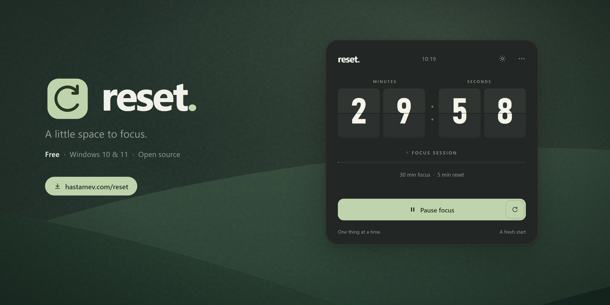
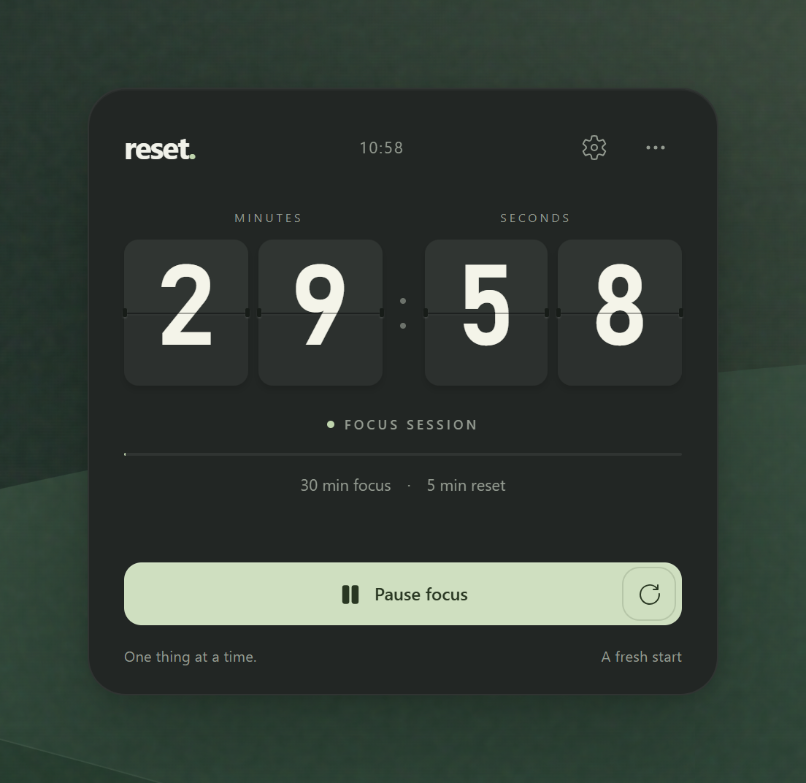
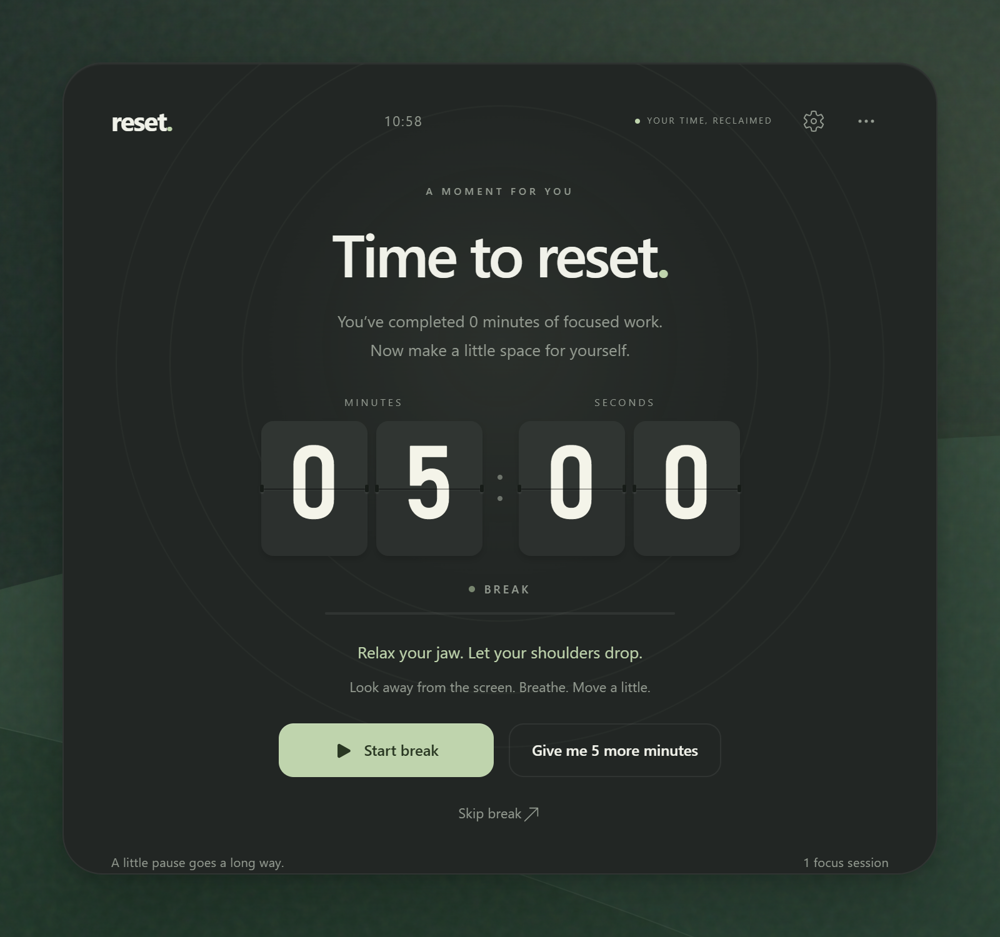
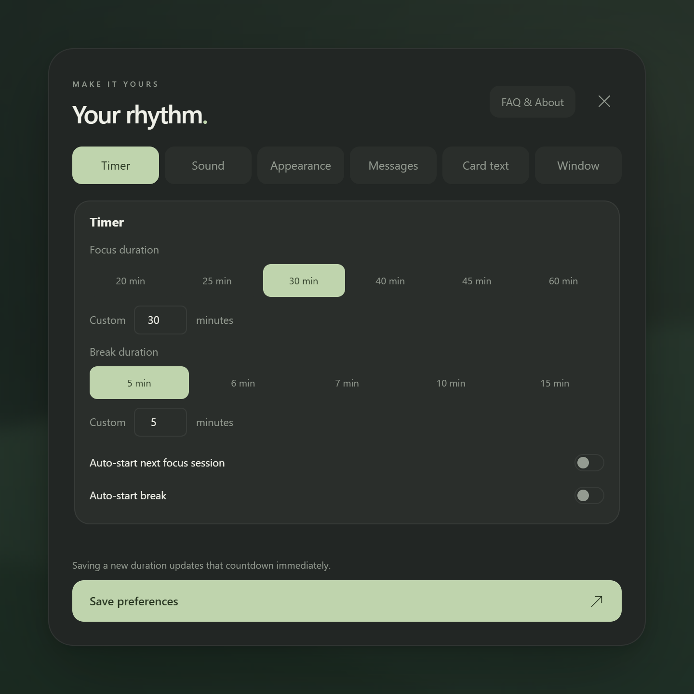

<div align="center">



<br>

[](https://github.com/binodray/Reset/releases/latest)
[](https://github.com/binodray/Reset/releases)
[](#download)
[](https://github.com/binodray/Reset/actions/workflows/windows.yml)
[](LICENSE)

**A calm desktop companion for focused work and gentle breaks.**<br>
A flip-clock widget keeps you on one thing at a time, then invites you to rest your eyes, stretch and breathe.

[**Download for Windows**](https://github.com/binodray/Reset/releases/latest/download/Reset-Setup.exe) &nbsp;·&nbsp; [Website](https://hastamev.com/reset) &nbsp;·&nbsp; [Watch the video](https://github.com/binodray/Reset/releases/latest/download/reset-promo.mp4) &nbsp;·&nbsp; [Release notes](CHANGELOG.md)

</div>

---

## Download

| | |
|---|---|
| **Installer** | [`Reset-Setup.exe`](https://github.com/binodray/Reset/releases/latest/download/Reset-Setup.exe) (latest release) |
| **Requires** | 64-bit Windows 10 or Windows 11 |
| **Install** | Per-user. No administrator rights, no account, no internet needed. |

Double-click `Reset-Setup.exe` and follow the dark setup wizard. Reset starts in the notification area beside the clock. Installing a newer version over an older one keeps your preferences.

> [!NOTE]
> The installer isn't code-signed yet, so Windows SmartScreen may show **“Windows protected your PC”** the first time. Choose **More info › Run anyway**.

## Why Reset?

Most timers shout. Reset is designed to stay quiet until it matters, and then to be kind about it.

<table>
<tr>
<td width="50%"></td>
<td width="50%"></td>
</tr>
<tr>
<td><b>Focus.</b> A mechanical flip clock counts down your session. When no session is running, it shows the time.</td>
<td><b>Reset.</b> When focus ends, the same card grows into a gentle break reminder with breathing rings and a short suggestion.</td>
</tr>
</table>

## Features

**Timer**
- Focus presets of 20, 25, 30, 40, 45 and 60 minutes, or any custom length from 1 to 99 minutes
- Break presets of 5, 6, 7, 10 and 15 minutes, or a custom 1 to 60 minutes
- Start, pause, restart, skip a break, add five minutes, or postpone a reminder
- A native, deadline-based countdown that stays accurate when the window is hidden or the PC sleeps

**Breaks that help**
- Ten rotating suggestions: relax your jaw, look at something far away, take a sip of water…
- Write your own break message (up to 180 characters)
- Calm breathing rings and a soft generated chime

**Make it yours**
- Six accent colours: Sage, Blue, Lavender, Peach, Rose and Teal
- Light, dark, or follow Windows
- Drag any corner to resize, or choose Mini, Small, Medium or Large. Reset remembers the size and position.
- Keep it behind other apps or always on top
- Reduced-motion support and animation intensity controls

**Respectful by design**
- Lives in the notification area, not the taskbar
- Launch at login, single instance, multi-monitor aware
- Preferences stay on your PC. No account, no telemetry, no network access.

<p align="center"></p>

## Using Reset

| Action | How |
|---|---|
| Show the widget | Click the Reset icon in the notification area |
| Settings, timer actions, exit | Right-click the notification-area icon, or use the ⚙ and ⋯ buttons on the card |
| Move | Drag the card's header |
| Resize | Drag any corner. Press <kbd>Esc</kbd> to cancel. |
| Start or pause | <kbd>Space</kbd> |
| Close Settings or a menu | <kbd>Esc</kbd> |

Settings → **FAQ & About** answers common questions inside the app.

## Build from source

Reset is built with [Tauri 2](https://v2.tauri.app), Rust and plain HTML, CSS and JavaScript. The frontend has no runtime dependencies.

**Prerequisites:** Node.js 22+, Rust 1.93+ with the MSVC toolchain, and Visual Studio 2022 Build Tools with *Desktop development with C++*. See the [Tauri Windows prerequisites](https://v2.tauri.app/start/prerequisites/#windows).

```powershell
git clone https://github.com/binodray/Reset.git
cd Reset
npm ci
npm run desktop          # run the app in development
npm run package          # build reset.exe and the NSIS installer
```

Or double-click **Build Reset.cmd**. It checks the prerequisites, runs every test and copies the finished installer to `Install Reset\Reset-Setup.exe`. See [INSTALL.md](INSTALL.md) for details.

To try the interface in a browser without building, run `npm run build` and open `Reset-preview.html`, or run `npm run dev` and visit http://localhost:1420.

### Tests

```powershell
npm test                                            # 32 interface and timer checks
cargo test --manifest-path src-tauri/Cargo.toml     # 14 native tests
```

### Project layout

```
src/                 Interface: widget, flip clock, settings, timer engine (no dependencies)
src-tauri/           Native shell: timing, preferences, window geometry, tray, startup
src-tauri/installer/ Dark NSIS installer template and artwork
scripts/             Build helpers
promo/               The 40-second promo video, rendered from code (see promo/README.md)
tests/               Node test suites
```

## Contributing

Bug reports and ideas are welcome. Please use the [issue forms](https://github.com/binodray/Reset/issues/new/choose) and include your Reset version (Settings → FAQ & About) and Windows version.

## Credits

Made by [Hastamev](https://hastamev.com). Icons from [Microsoft Fluent UI System Icons](https://github.com/microsoft/fluentui-system-icons) (MIT). Built on [Tauri](https://tauri.app).

## License

[MIT](LICENSE) © 2026 Hastamev
